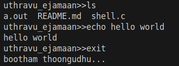

# C-Basic-Shell

This is a personal learning project where I'm building a basic shell in C to deepen my understanding of Unix-like operating systems and strengthen my C programming skills.

### Features
- Executes basic Unix commands using `execvp`
- Handles user input and basic command parsing
- Supports built-in command: `exit`

### Feature in progress
- I/O Redirection (`>`, `<`)
  
### Upcoming features
- Piping (`|`)
- Background processes (`&`)
- Support for more built-in commands (`cd`, `pwd`, etc.)

This is a work in progress — more features will be added step-by-step!

A sample image of the shell,

